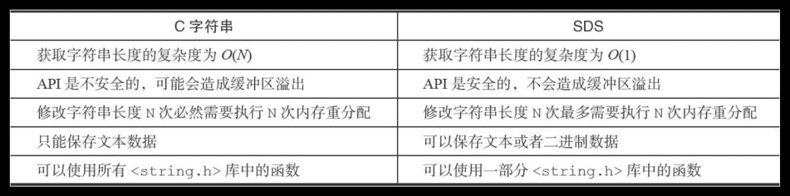
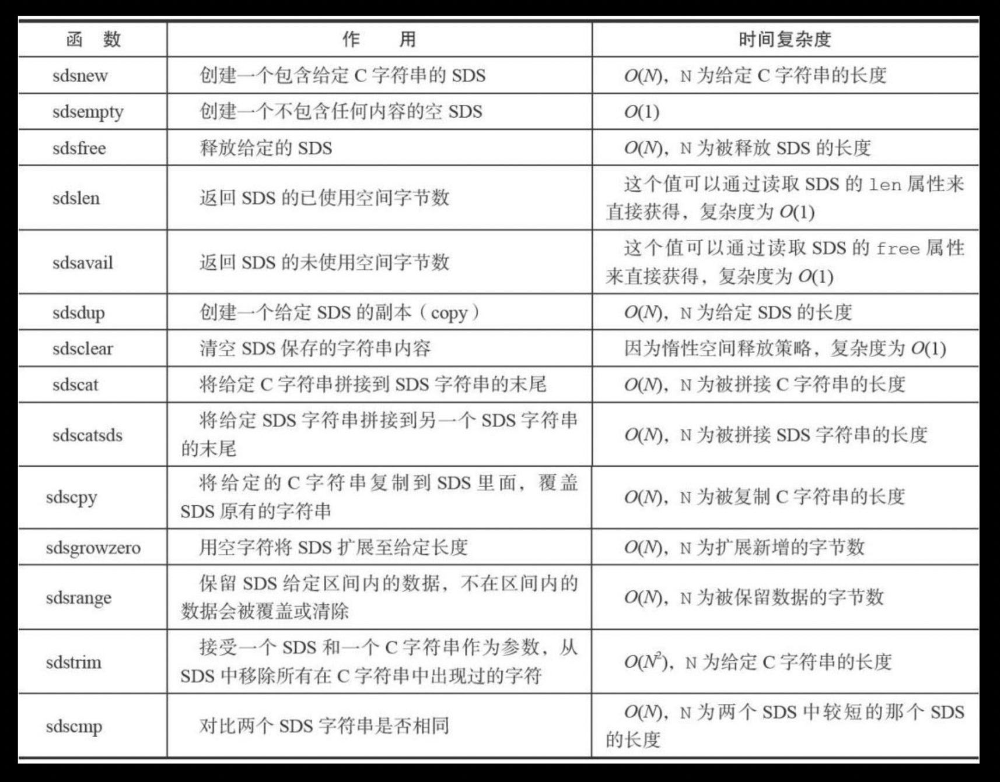

# Simple Dynamic String (简单动态字符串)
## 01 源代码：src/sds.c 、src/sds.h
## 02 数据结构：
### 3.0结构
```c
/*
 * 保存字符串对象的结构
 */
struct sdshdr {
    
    // buf 中已占用空间的长度
    int len;

    // buf 中剩余可用空间的长度
    int free;

    // 数据空间
    char buf[];
};
```
特点:
* len保存字符串长度让查询字符串长度时间复杂度从O(N)降到O(1)
* len保存字符串长度符串长度避免字符拼接等操作出现缓冲区溢出
* free保存可用空间减少内存重分配时系统调用的次数
    * 空间预分配
        * 修改sds如果len小于1M,会分配和len等长的free空间
        * 修改sds如果len大于等于1M,会分配1M的free空间
    * 惰性空间释放
        * sds字符串缩短后并不会立即回收内存，而是记录到free，方便下次使用

* sds是二进制安全的，解决中间出现`\0`的问题
* sds兼容<string.h>字符串操作  

引用《Redis设计与实现》与C字符串对比

引用《Redis设计与实现》api

***

### 6.2.6
```c
/* Note: sdshdr5 is never used, we just access the flags byte directly.
 * However is here to document the layout of type 5 SDS strings. */
struct __attribute__ ((__packed__)) sdshdr5 {
    unsigned char flags; /* 3 lsb of type, and 5 msb of string length */
    char buf[];
};
struct __attribute__ ((__packed__)) sdshdr8 {
    uint8_t len; /* used */
    uint8_t alloc; /* excluding the header and null terminator */
    unsigned char flags; /* 3 lsb of type, 5 unused bits */
    char buf[];
};
struct __attribute__ ((__packed__)) sdshdr16 {
    uint16_t len; /* used */
    uint16_t alloc; /* excluding the header and null terminator */
    unsigned char flags; /* 3 lsb of type, 5 unused bits */
    char buf[];
};
struct __attribute__ ((__packed__)) sdshdr32 {
    uint32_t len; /* used */
    uint32_t alloc; /* excluding the header and null terminator */
    unsigned char flags; /* 3 lsb of type, 5 unused bits */
    char buf[];
};
struct __attribute__ ((__packed__)) sdshdr64 {
    uint64_t len; /* used */
    uint64_t alloc; /* excluding the header and null terminator */
    unsigned char flags; /* 3 lsb of type, 5 unused bits */
    char buf[];
};
```
区别：  
- `__attribute__ ((__packed__))` 取消字节对齐，方便直接通过内存访问结构体内部变量  
- len、alloc、flags组成sds的header  
- len与3.0版本一致，alloc保存除了头部和buf最后默认携带的`\0`的长度。

