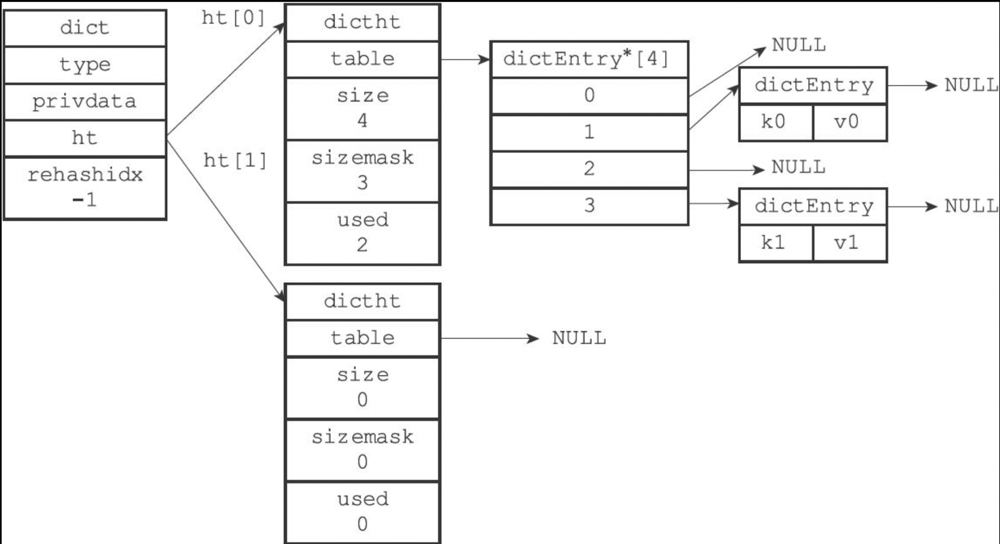
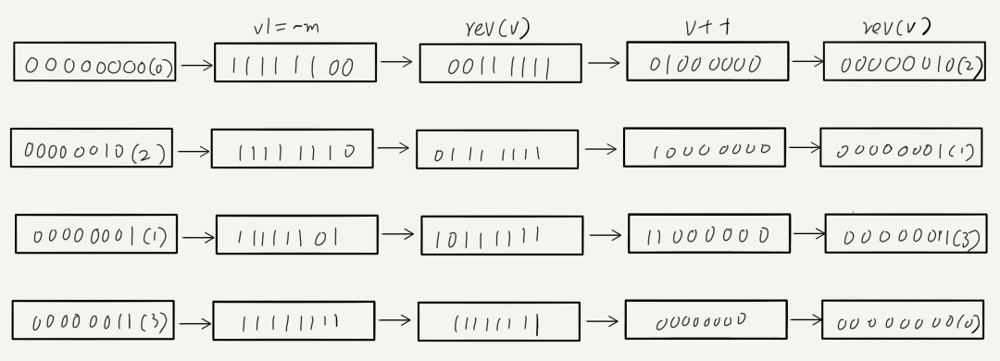
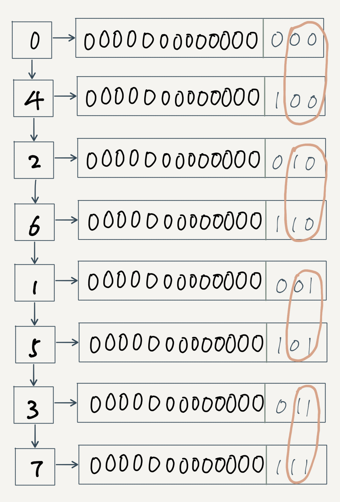
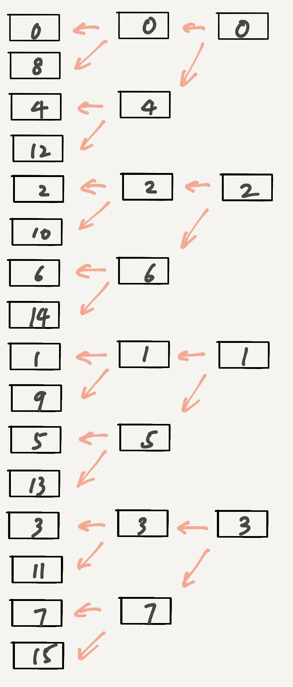
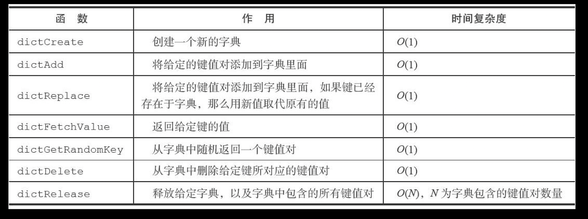

# 字典

每个字典有两张哈希表,第二张哈希表表用于rehash

```c
/*
 * 字典
 */
typedef struct dict {

    // 类型特定函数
    dictType *type;

    // 私有数据
    void *privdata;

    // 哈希表
    dictht ht[2];

    // rehash 索引
    // 当 rehash 不在进行时，值为 -1
    int rehashidx; /* rehashing not in progress if rehashidx == -1 */

    // 目前正在运行的安全迭代器的数量
    int iterators; /* number of iterators currently running */

} dict;
```

在插入字典时通过计算负载因子(used/size)判断是否需要rehash,rehash会在ht[1]去做，然后释放ht[0]上的节点，最后将ht[1]作为新的ht[0]，rehash过程中如果添加新的节点都会添加到ht[1]上。

渐进式rehash: ht[0]到ht[1]不是一次性完成，而是将这个操作分布到更新、删除、查找等操作中，每次检测一下是否在rehash,然后进行一次单步rehash `// 进行单步 rehash ，T = O(1) if (dictIsRehashing(d)) _dictRehashStep(d);`

```c
    // 一下两个条件之一为真时，对字典进行扩展
    // 1）字典已使用节点数和字典大小之间的比率接近 1：1
    //    并且 dict_can_resize 为真
    // 2）已使用节点数和字典大小之间的比率超过 dict_force_resize_ratio
    if (d->ht[0].used >= d->ht[0].size &&
        (dict_can_resize ||
         d->ht[0].used/d->ht[0].size > dict_force_resize_ratio))
    {
        // 新哈希表的大小至少是目前已使用节点数的两倍
        // T = O(N)
        return dictExpand(d, d->ht[0].used*2);
    }
```



每一个hash节点都有一个`next`指针构成链表用来解决hash碰撞(链地址法),如果发生键冲突，新的节点会采用头插法插入到链表

```c
/*
 * 哈希表节点
 */
typedef struct dictEntry {
    
    // 键
    void *key;

    // 值
    union {
        void *val;
        uint64_t u64;
        int64_t s64;
    } v;

    // 指向下个哈希表节点，形成链表
    struct dictEntry *next;

} dictEntry;

/* This is our hash table structure. Every dictionary has two of this as we
 * implement incremental rehashing, for the old to the new table. */
/*
 * 哈希表
 *
 * 每个字典都使用两个哈希表，从而实现渐进式 rehash 。
 */
typedef struct dictht {
    
    // 哈希表数组
    dictEntry **table;

    // 哈希表大小
    unsigned long size;
    
    // 哈希表大小掩码，用于计算索引值
    // 总是等于 size - 1
    unsigned long sizemask;

    // 该哈希表已有节点的数量
    unsigned long used;

} dictht;
```

# scan
redis中的`dictScan`可以保证
- 不出现重复数据
- 不遗漏数据
以上主要是基于`rehash`情况下考虑的,hash表的扩缩后的大小总是2^N

```c  
    /* Set unmasked bits so incrementing the reversed cursor
     * operates on the masked bits of the smaller table */
    v |= ~m0;

    /* Increment the reverse cursor */
    v = rev(v);
    v++;
    v = rev(v);c
```




上面那段代码就是在当前的有效位数(比如四节点则有效位数2)范围内，从左到右进一位。  

假设在遍历了0，返回2之后，字典进行了扩容，并在完成扩容后,则接下来应该访问 2 -> 6 -> 1 -> 5 -> 3 -> 7。
4已经在第一轮遍历0的时候，把扩容后的4的数据也访问了。 
假设扩容前有效位为m，扩容后有效位则为m+1。 


以上是遍历 -> rehash -> 遍历，还有一种情况是遍历中rehash还未完成......

## API

## 随记
解决未使用编译警告
```c
#define DICT_NOTUSED(V) ((void) V)
```
