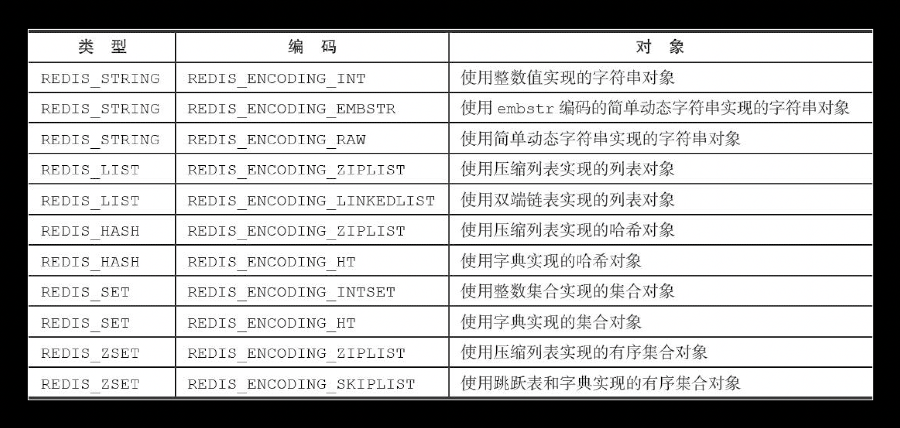
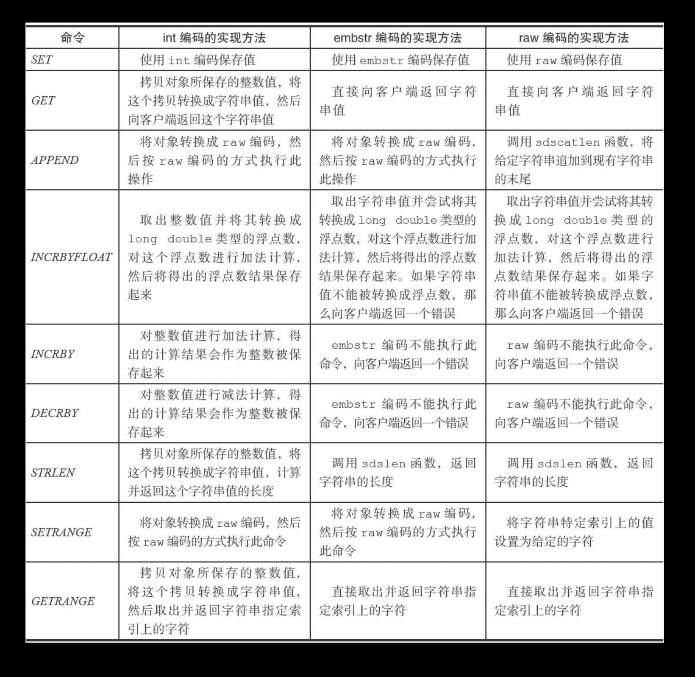
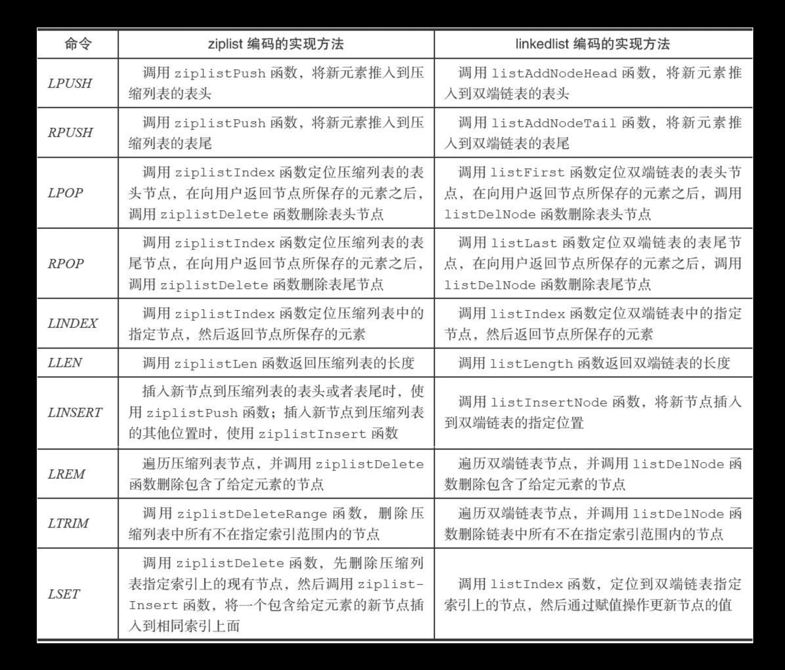
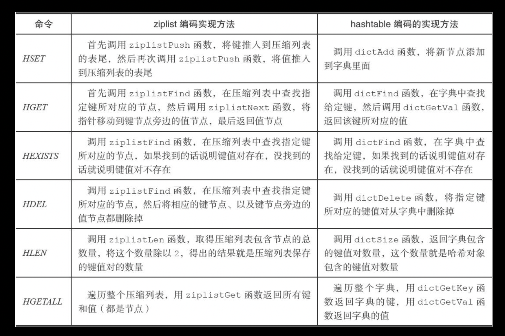
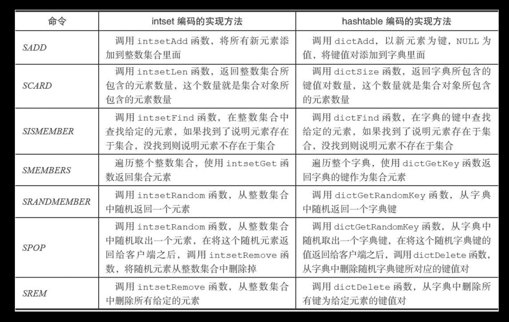
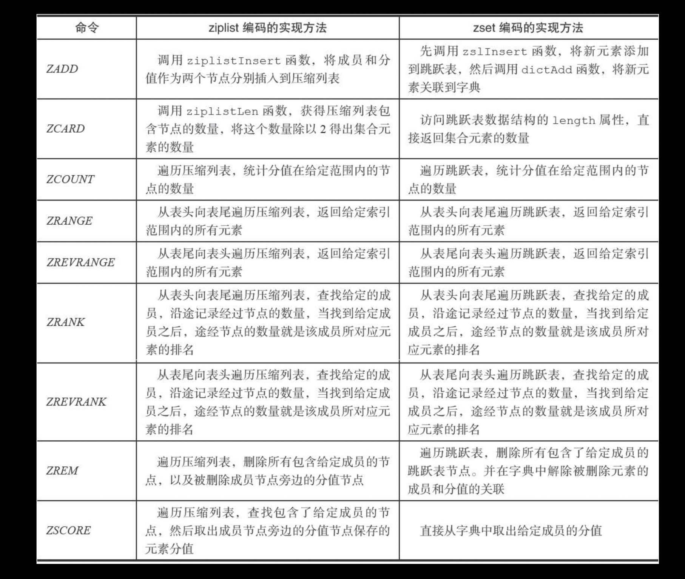

# 对象
redis不会直接使用底层的数据结构，而是基于底层的数据结构建立了对象系统，每一种对象根据不同的条件可能采用不同的数据结构
## 数据结构
该结构体采用位域来节省空间
1. 位域必须存储在同一个类型中，不能跨类型，同时也说明位域的长度不会超过所定义类型的长度。如果一个定义类型单元里所剩空间无法存放下一个域，则下一个域应该从下一单元开始存放。例如：所定义的类型是int类型，一共32为，目前用掉了25位还剩下7位，这时要存储一个8位的位域元素，那么这个元素就只能从下一个int类型的单元开始而不会在前面一个int类型中占7为后面的int类型中占1位。
2. 如果位域的位域长度为0表示是个空域，同时下一个域应当从下一个字节单元开始存放。
3. 使用无名的位域来作为填充和调整位置，切记该位域是不能被使用的。
4. 位域的本质上就是一种结构体类型，不同的是其成员是按二进制位来分配的

```c
typedef struct redisObject {

    // 类型
    unsigned type:4;

    // 编码
    unsigned encoding:4;

    // 对象最后一次被访问的时间, 减去当前的时间为该对象空转的时间
    unsigned lru:REDIS_LRU_BITS; /* lru time (relative to server.lruclock) */

    // 引用计数,= 0时释放内存
    int refcount;

    // 指向实际值的指针
    void *ptr;

} robj;
```

## 对象类型
```c
#define REDIS_STRING 0  //字符串对象
#define REDIS_LIST 1    //列表对象
#define REDIS_SET 2     //集合对象
#define REDIS_ZSET 3    //有序集合对象
#define REDIS_HASH 4    //哈希对象
```

## 对象编码
对象的编码决定了`ptr`采用什么类型的底层数据结构

```c
// 对象编码
#define REDIS_ENCODING_RAW 0     /* Raw representation */
#define REDIS_ENCODING_INT 1     /* Encoded as integer */
#define REDIS_ENCODING_HT 2      /* Encoded as hash table */
#define REDIS_ENCODING_ZIPMAP 3  /* Encoded as zipmap */
#define REDIS_ENCODING_LINKEDLIST 4 /* Encoded as regular linked list */
#define REDIS_ENCODING_ZIPLIST 5 /* Encoded as ziplist */
#define REDIS_ENCODING_INTSET 6  /* Encoded as intset */
#define REDIS_ENCODING_SKIPLIST 7  /* Encoded as skiplist */
#define REDIS_ENCODING_EMBSTR 8  /* Embedded sds string encoding */
```
## 对象编码与对象类型的映射关系


## 01字符串对象
`t_string.c`
字符串编码可以是 int,raw,embstr

```c
    // 尝试将 RAW 编码的字符串编码为 EMBSTR 编码
    if (len <= REDIS_ENCODING_EMBSTR_SIZE_LIMIT) {
        robj *emb;
```

embstr专门针对短字符串设计，分配一块连续的内存保存`redisObject`与`sdshdr`，这样设计的好处与压缩列表类似，可以减少分配、释放内存的次数,连续的内存也方便存入缓存

### 编码转换
- int    -> raw 当在整数后面`append`一个字符串时
- embstr -> raw `embstr`是只读的，所有修改操作都会转变成`raw`



## 02列表对象
列表对象的编码可以是ziplist,linkedlist

### 编码转换
当字符串元素的长度小于`list-max-ziplist-value`或元素个数小于`list-max-ziplist-entries`使用ziplist，否则使用双端链表`linkedlist`

配置文件`redis.conf`
```
# Similarly to hashes, small lists are also encoded in a special way in order
# to save a lot of space. The special representation is only used when
# you are under the following limits:
list-max-ziplist-entries 512
list-max-ziplist-value 64
```



## 03哈希对象
哈希对象的编码可以是ziplist,hashtable,使用ziplist，从列表尾先插入key后插入value

### 编码转换
使用`ziplist`实现哈希对象取决于键值对长度与键值对数量
```
# Hashes are encoded using a memory efficient data structure when they have a
# small number of entries, and the biggest entry does not exceed a given
# threshold. These thresholds can be configured using the following directives.
hash-max-ziplist-entries 512
hash-max-ziplist-value 6
```


## 04集合对象
集合对象的编码可以是intset,hashtable

当使用hashtable编码时，hashtable的key存放集合的元素，value都指向NULL
### 编码转换
inset编码条件是 1集合所有元素都是整形，2集合元素不大于`set-max-intset-entries`
```
# Sets have a special encoding in just one case: when a set is composed
# of just strings that happens to be integers in radix 10 in the range
# of 64 bit signed integers.
# The following configuration setting sets the limit in the size of the
# set in order to use this special memory saving encoding.
set-max-intset-entries 5
```


## 05有序集合对象
有序集合的编码可以是ziplist或者zskiplist(zset)

ziplist按分值由小到大排列  
ziplist 会按照 "｜元素 ｜ 分值 |" 存储

如果使用zset, zskiplist也是按照分值由小到大存储元素，而dict中的key存储元素，value存储元素对应的分值,这两个数据结构会共享相同的元素和分值
特点：
- 节约内存
- 保证查找单个元素的分值的时间复杂度为O(1)
- 保证按分值范围操作的时间复杂度为O(logN)
```c
/*
 * 有序集合
 */
typedef struct zset {

    // 字典，键为成员，值为分值
    // 用于支持 O(1) 复杂度的按成员取分值操作
    dict *dict;

    // 跳跃表，按分值排序成员
    // 用于支持平均复杂度为 O(log N) 的按分值定位成员操作
    // 以及范围操作
    zskiplist *zsl;

} zset;

```

### 编码转换
当集合元素个数和和长度都不大于以下配置时使用ziplist,否则使用zset
```
# Similarly to hashes and lists, sorted sets are also specially encoded in
# order to save a lot of space. This encoding is only used when the length and
# elements of a sorted set are below the following limits:
zset-max-ziplist-entries 128
zset-max-ziplist-value 64
```



## 共享
redis会共享字符串对象，考虑到每次创建新对象都需要判断这个对象是否已经存在，如果对象的结构复杂会增加时间复杂度，所以该字符串只限于字符串对象的编码是int, 范围是 `0 ~ #define REDIS_SHARED_INTEGERS 10000`,这样判断的时间复杂度是O(1)
