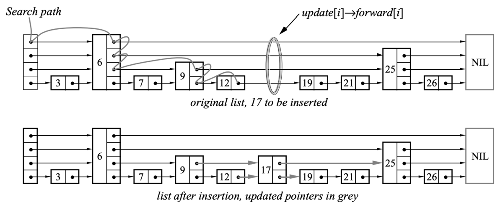
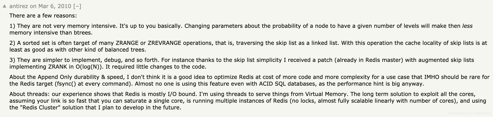

# 跳表 
跳表会在链表上添加索引层，提升查找效率,时间复杂度会从O(N)降到O(logN)

## 跳表与跳表插入
- 由多层组成，最底层为第1层，次底层为第2层，以此类推。层数不会超过一个固定的最大值Lmax。
- 每层都是一个有头节点的有序链表，第1层的链表包含跳表中的所有元素。
- 如果某个元素在第k层出现，那么在第1~k-1层也必定都会出现，但会按一定的概率p在第k+1层出现。




## 数据结构
```c
/* ZSETs use a specialized version of Skiplists */
/*
 * 跳跃表节点
 */
typedef struct zskiplistNode {

    // 成员对象
    robj *obj;

    // 分值
    double score;

    // 后退指针
    struct zskiplistNode *backward;

    // 层
    struct zskiplistLevel {

        // 前进指针
        struct zskiplistNode *forward;

        // 跨度
        unsigned int span; //表示forward指针跳过了多少节点,包含forward指向的节点但是不含当前节点

    } level[];

} zskiplistNode;

/*
 * 跳跃表
 */
typedef struct zskiplist {

    // 表头节点和表尾节点
    struct zskiplistNode *header, *tail;

    // 表中节点的数量
    unsigned long length;

    // 表中层数最大的节点的层数
    int level;

} zskiplist;
```

## 
```c
zskiplistNode *update[ZSKIPLIST_MAXLEVEL], *x; //update 为插入后需要更新的节点
unsigned int rank[ZSKIPLIST_MAXLEVEL]; //rank对应update的节点span的节点数， +1 为更新后的节点数
```

```c
//只保留random最低两字节的值,其他都置0; level 1/4的概率+1
static int zslRandomLevel(void) {
    int level = 1;

    while ((random()&0xFFFF) < (ZSKIPLIST_P * 0xFFFF))
        level += 1;

    return (level<ZSKIPLIST_MAXLEVEL) ? level : ZSKIPLIST_MAXLEVEL;
}
```

## 作者回应为什么不用平衡树
