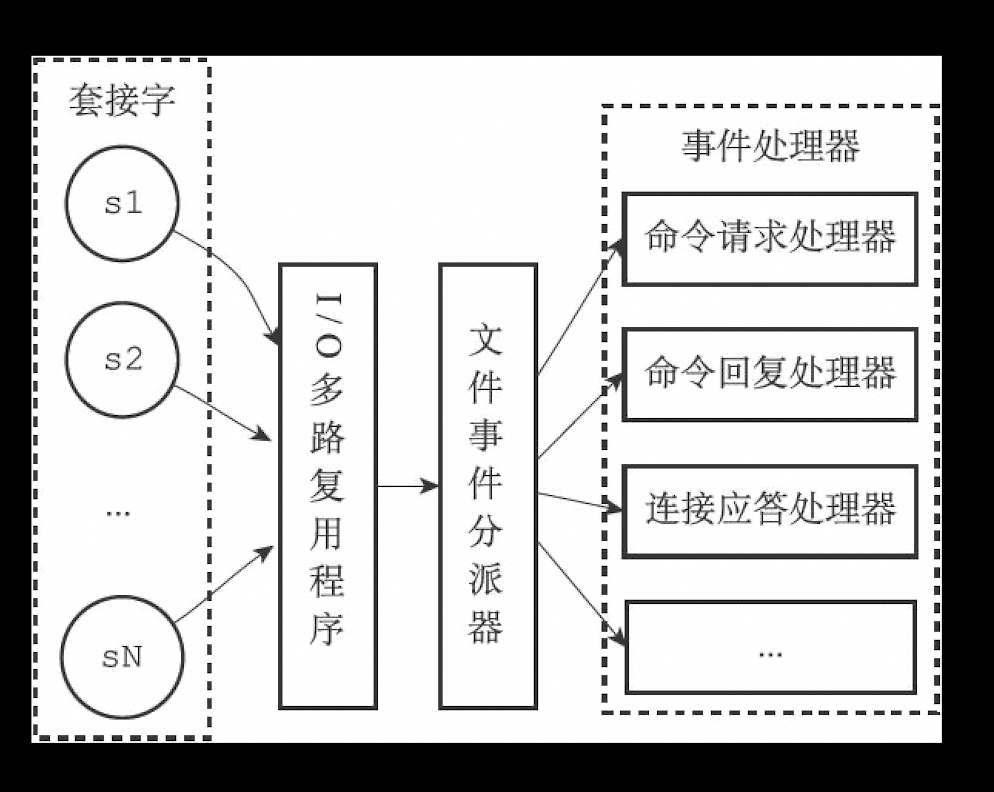

## 文件事件
redis客户端与服务端通过套接字连接,文件事件就是服务器对redis套接字的抽象
## 文件事件处理器
使用IO多路复用来监听多个套接字，并对套接字执行的任务关联不同的事件处理器


虽然文件事件会并发出现，但IO多路复用程序会将套接字事件放到同步队列里，按顺序发送给文件事件分配器

## IO多路复用程序
对select,epoll,kqueue,等多路复用函数的封装，类似于策略模式,会在编译阶段选择最合适的函数库
```c
#ifdef HAVE_EVPORT
#include "ae_evport.c"
#else
    #ifdef HAVE_EPOLL
    #include "ae_epoll.c"
    #else
        #ifdef HAVE_KQUEUE
        #include "ae_kqueue.c"
        #else
        #include "ae_select.c"
        #endif
    #endif
#endif
```
## 文件事件结构
```c
/* File event structure
 *
 * 文件事件结构
 */
typedef struct aeFileEvent {

    // 监听事件类型掩码，
    // 值可以是 AE_READABLE 或 AE_WRITABLE ，
    // 或者 AE_READABLE | AE_WRITABLE
    int mask; /* one of AE_(READABLE|WRITABLE) */

    // 读事件处理器
    aeFileProc *rfileProc;

    // 写事件处理器
    aeFileProc *wfileProc;

    // 多路复用库的私有数据
    void *clientData;

} aeFileEvent;
```

`aeCreateFileEvent` //根据 mask 参数的值，监听 fd 文件的状态

`aeDeleteFileEvent` //将 fd 从 mask 指定的监听队列中删除

`aeGetFileEvents` //获取给定 fd 正在监听的事件类型

`aeWait` //在给定毫秒内等待，直到 fd 变成可写、可读或异常 (poll)

`aeApiPoll` //在指定时间内阻塞等待所有 `aeCreateFileEvent` 设置监听的套接字,当至少一个事件或超时，函数返回,更新就绪的文件事件 aeFiredEvent *fired; /* Fired events */

## 文件事件分配器
`aeProcessEvents`  //处理所有已到达的时间事件，以及所有已就绪的文件事件。

## 文件事件处理器

- 链接应答处理器 `acceptTcpHandler`
- 命令请求处理器 `readQueryFromClient`
- 命令回复处理器 `sendReplyToClient`

流程：
1. io多路复用监听所有fd，当有客户端`connect`，触发**链接应答处理器**执行`accept`
```c
    // 为 TCP 连接关联连接应答（accept）处理器
    // 用于接受并应答客户端的 connect() 调用
    for (j = 0; j < server.ipfd_count; j++) {
        if (aeCreateFileEvent(server.el, server.ipfd[j], AE_READABLE,
            acceptTcpHandler,NULL) == AE_ERR)
            {
                redisPanic(
                    "Unrecoverable error creating server.ipfd file event.");
            }
    }
```

2. `accept`后会创建客户端套接字，监听这个套接字,当客户端发送命令，触发**命令请求处理器**接收命令

```c
        // 绑定读事件到事件 loop （开始接收命令请求）
        if (aeCreateFileEvent(server.el,fd,AE_READABLE,
            readQueryFromClient, c) == AE_ERR)
        {
            close(fd);
            zfree(c);
            return NULL;
        }
```

3. 当客户端准备好时，返回给客户端执行结果
```c
    // 一般情况，为客户端套接字安装写处理器到事件循环
    if (c->bufpos == 0 && listLength(c->reply) == 0 &&
        (c->replstate == REDIS_REPL_NONE ||
         c->replstate == REDIS_REPL_ONLINE) &&
        aeCreateFileEvent(server.el, c->fd, AE_WRITABLE,
        sendReplyToClient, c) == AE_ERR) return REDIS_ERR;

```
